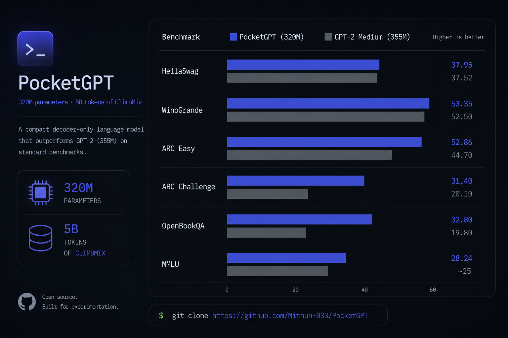

# PocketGPT — Efficient Language Modeling at 320M Parameters



A GPT-style autoregressive language model implemented from scratch using PyTorch and PyTorch Lightning.

The project covers tokenizer training, large-scale pretraining, Transformer architecture implementation, custom optimizer, dataset preparation.

PocketGPT is pretrained on **5 billion tokens of NVIDIA ClimbMix** and serves as a foundation for experimentation with modern language model architectures and efficient training techniques.

---
## Base Model Benchmark Comparison

| Benchmark     | GPT-2 Medium (355M) | Pythia 410M | PocketGPT (320M) |
|---------------|--------------------:|------------:|-----------------:|
| HellaSwag     | **37.52**           | **40.9**    | **37.95** |
| WinoGrande    | **52.5**            | **53.7**    | **53.35** |
| ARC Easy      | **44.7**            | **52.1**    | **52.86** |
| ARC Challenge | **20.1**            | **21.3**    | **31.40** |
| OpenBookQA    | **19.8**            | —           | **32.80** |
| MMLU          | ~25                 | **27.3**    | **28.24** |


> **Source (GPT-2 Medium (355M) :** Wu et al. (2024), *SkipV1Former* ([arXiv:2510.16807](https://arxiv.org/abs/2510.16807)); 
> Sangale (2026), [Bonsai LLM Evals](https://recsysml.substack.com/p/llm-evals-from-scratch-run-your-first); 
> aggregated across multiple papers — treat as estimates (±1–2%).

> **Source (Pythia 410M) :** Biderman et al. (2023), *Pythia: A Suite for Analyzing Large Language Models Across Training and Scaling* ([arXiv:2304.01373](https://arxiv.org/abs/2304.01373)), Table G.1 (zero-shot);
> HellaSwag and MMLU from the Hugging Face Open LLM Leaderboard evaluation run ([dataset](https://huggingface.co/datasets/open-llm-leaderboard/EleutherAI__pythia-410m-details)).
> OpenBookQA not reported in either source — omitted.
---

## Model Specifications

| Parameter | Value |
|------------|------------|
| Architecture | Decoder-only Transformer |
| Training Tokens | 5 Billion |
| Context Length | 1,024 |
| Layers | 20 |
| Hidden Dimension | 1,024 |
| Attention Heads | 16 |
| KV Heads | 4 |
| Head Dimension | 64 |
| MLP Dimension | 4,096 |
| Vocabulary Size | 49,152 |
| VE Gate Rank | 16 |
| Backbone Parameters | ~214.23M |
| Token Embeddings | ~106.66M |
| Value Embeddings | ~503.33M |
| Total Parameters | ~320.89M |
| Total Parameters with VE | ~824.22M |

---

## Features

### Architecture

- Decoder-only Transformer
- Rotary Positional Embeddings (RoPE)
- RMSNorm
- Pre-Norm Transformer blocks
- Grouped Query Attention (GQA)
- Query & Key RMSNorm
- ReLU² feed-forward networks
- DeepSeek-style residual scaling
- Alternate-layer value embeddings
- Flash Attention support when available

### Training Infrastructure

- Custom Muon–AdamW hybrid optimizer
- Optimized PyTorch DataLoaders
- Dataclass-based configuration system
- Modular training pipeline
- Reproducible experiment setup
- Custom learning rate scheduling

### Tokenization

- Custom tokenizer training pipeline
- 32K/49K vocabulary tokenizers (ByteLevel & Whitespace)
- Reusable tokenizer artifacts

---

## Training Data

### Base Pretraining

- **5 Billion Tokens of NVIDIA ClimbMix**

---

## Repository Structure

```text
PocketGPT/
├── GPT/
│   ├── Hyperparams.py
│   ├── Model.py
│   ├── Optimizer.py
│   ├── inference.py
│   └── smoke_test.py
├── scripts/
│   ├── dependencies.sh
│   ├── tokenizer.sh
│   └── train.sh
├── tokenizer/
│   ├── DataPrep.py
│   ├── Tokenizer_train.py
│   ├── tokenizers_benchmark.py
│   ├── Compression_ratios.json
│   ├── tokenizer_32k_ByteLevel.json
│   ├── tokenizer_32k_whitespace.json
│   ├── tokenizer_49k_ByteLevel.json
│   └── tokenizer_49k_whitespace.json
├── train/
│   ├── DataLoaders.py
│   ├── data.py
│   ├── eval.py
│   └── train.py
├── val_loss (upto 2.3bil toks)/
│   ├── perplexity.png
│   ├── train_log.json
│   ├── train_val_loss.png
│   ├── val_delta.png
│   └── val_log.json
├── LICENSE
├── PocketGPT.png
└── README.md
```

---

## Available Tokenizers

| Tokenizer                     | Vocabulary Size |
|------------------------------|-----------------|
| tokenizer_32k_ByteLevel.json | 32,768          |
| tokenizer_32k_whitespace.json| 32,768          |
| tokenizer_49k_ByteLevel.json | 49,152          |
| tokenizer_49k_whitespace.json| 49,152          |

---

## Tech Stack

- Python
- PyTorch
- PyTorch Lightning
- Hugging Face Datasets
- Hugging Face Tokenizers
- NumPy

---

## Project Goal

PocketGPT is an end-to-end language model training project focused on building modern GPT-style architectures from the ground up.

The project explores:

- Tokenizer training
- Dataset preparation
- Transformer implementation
- Custom optimization techniques
- Large-scale language model pretraining
- Efficient training infrastructure

while maintaining a modular, reproducible, and extensible codebase for future experimentation.
